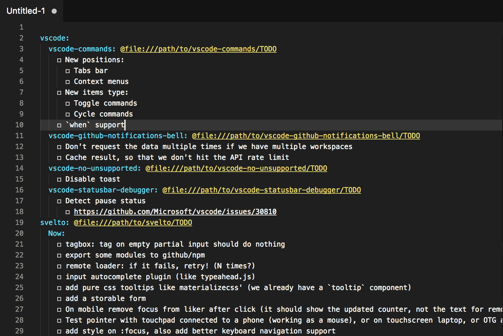

# VSC Projects+ Todo+

<p align="center">
	
</p>

Bird's-eye view over your projects, view all your todo files aggregated into one.

## Install

This extension uses [Projects+](https://marketplace.visualstudio.com/items?itemName=fabiospampinato.vscode-projects-plus) to get a list of your projects and [Todo+](https://marketplace.visualstudio.com/items?itemName=fabiospampinato.vscode-todo-plus) to provide support for the `Todo` language, having them installed is a requirement.

Run the following in the command palette:

```shell
ext install vscode-projects-plus
ext install vscode-todo-plus
ext install vscode-projects-plus-todo-plus
```

## Usage

It adds 1 command to the command palette:

```js
Projects: Todo // Open a file containg all your todo files aggregated into one
```

## Settings

```js
{
  "projectsTodo.indentation": "  ", // String used for indentation
  "projectsTodo.showPaths": true, // Show individual todo files paths
  "projectsTodo.hideEmpty": true, // Hide projects and groups without any todo
  "projectsTodo.hideDone": true, // Hide any done todo
  "projectsTodo.hideCancelled": true, // Hide any cancelled todo
  "projectsTodo.hideComments": false, // Hide all the comments
  "projectsTodo.hideArchives": true, // Hide any archive section
  "projectsTodo.filterRegex": false // List only projects having a name matching this regex
}
```

## Demo



## License

MIT © Fabio Spampinato
